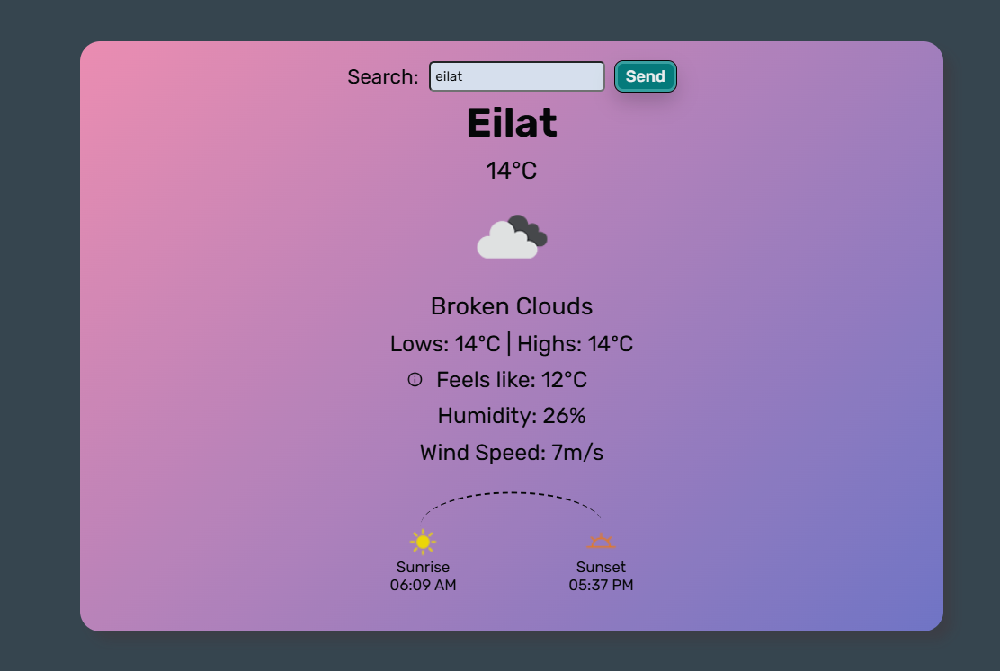

# Weather Cast

A live weather application that fetches real-time temperature and detailed weather data for any city using the OpenWeatherMap API.



---

## Table of Contents

- [Overview](#overview)
- [Features](#features)
- [Demo](#demo)
- [Tech Stack](#tech-stack)
- [Project Structure](#project-structure)
- [Getting Started](#getting-started)
- [API Reference](#api-reference)
- [Configuration](#configuration)
- [Known Limitations](#known-limitations)
- [License](#license)

---

## Overview

Weather Cast is a single-page weather app. The user enters a city name and the app fetches current weather conditions — including temperature, weather description, sunrise/sunset times, and more — using the OpenWeatherMap REST API.

---

## Features

- 🌤️ Real-time weather data for any city worldwide
- 🌡️ Temperature displayed in metric units (°C)
- 🌅 Sunrise and sunset times
- 📝 Weather description
- ℹ️ Info button for additional details
- 🎨 Custom cursor and button styles

---

## Demo

Open `index.html` in any modern browser. An active internet connection is required to fetch weather data.

---

## Tech Stack

| Technology | Purpose |
|---|---|
| HTML5 | Semantic page structure |
| CSS3 | Styling and layout |
| JavaScript (ES6+) | API calls, DOM manipulation, async/await |
| Google Fonts | Custom web font (Noto Serif Todhri) |
| OpenWeatherMap API | Live weather data source |

---

## Project Structure

```
weather-cast/
├── index.html          # Main HTML file
├── script.js           # Application logic and API integration
├── style.css           # Component and page styles
├── general.css         # Base/reset styles
├── shiny_button.css    # Button component styles
├── weather.drawio      # Architecture/flow diagram (draw.io)
└── images/
    ├── cursor_24x24.png
    ├── select-cursor_24x24.png
    ├── select-cursor-3_24x24.png
    ├── sunrise24px.png
    ├── sunset24px.png
    └── info24px.png
```

---

## Getting Started

1. Clone or download the repository.
2. Open `index.html` in any modern browser.
3. Ensure you have an active internet connection.

> **Note:** The API key is included in `script.js` for demo purposes. For production use, API keys should never be committed to version control. See [Configuration](#configuration) below.

---

## API Reference

This project uses the [OpenWeatherMap Current Weather API](https://openweathermap.org/current).

| Endpoint | Description |
|---|---|
| `GET https://api.openweathermap.org/data/2.5/weather?units=metric&appid={API_KEY}&q={city}` | Fetches current weather for a given city |

**Key response fields used:**
- `main.temp` — current temperature
- `weather[0].description` — weather description
- `sys.sunrise` / `sys.sunset` — sunrise and sunset timestamps

---

## Configuration

The API key is stored as a constant in `script.js`:

```js
const API_KEY = "your_api_key_here";
```

To use your own key:
1. Create a free account at [openweathermap.org](https://openweathermap.org/).
2. Generate an API key from your dashboard.
3. Replace the value of `API_KEY` in `script.js`.

> ⚠️ **Security Note:** Never expose API keys in public repositories. For production apps, store keys in environment variables or a backend proxy.

---

## Known Limitations

- City name must be entered in English for reliable API results.
- The app relies on the OpenWeatherMap free tier, which has rate limits.
- No offline/fallback mode — requires an active internet connection.

---

## License

This project is intended for educational and portfolio purposes.
